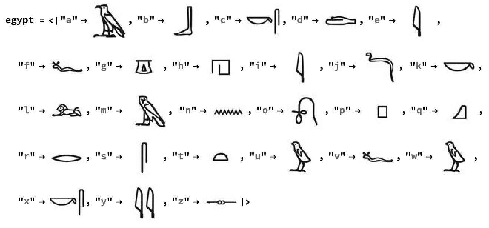

## Associating hieroglyphs with letters

--- task ---
If you have never used the Wolfram Language before, follow [this guide to get started](https://projects.raspberrypi.org/en/projects/getting-started-with-mathematica) and learn to use the tool. Look at the sections **Starting Mathematica** and **Programming in Mathematica**. --- /task ---

To represent English letters and sounds with hieroglyphs, we need to make an `Association`. An `Association` is like a dictionary or a set of rules.

```
practiceAssociation = <|"Mark" -> "English", "Rachel" -> "Science", "Aisha" -> "History", "Omar" -> "Art"|>
```

In this example, the students: Mark, Rachel, Aisha, and Omar, are the `Keys`, and their favourite subjects: English, Science, History and Art, are the `Values`. Each `Key` has a `Value`, and you can look up the `Value` for a specific `Key`.

In this example, if you evaluate `practiceAssociation["Rachel"]`, you get the subject "Science".

You need to start with an `Association` for letters (the `Keys`) to hieroglyphs (the `Values`). Hieroglyphs represent sounds, so they are not exactly matched to English letters, but they are still fun to use. It would take a long time to copy and paste the 26 images to create that association, so we have created a starter file that you can use.

--- task ---

Download the [starter file](#) and open it in Mathematica.



--- /task ---
