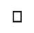

## Associating Hieroglyphs with Letters

In order to represent English letters and sounds with hieroglyphs, we need to make an `Association`. An Association is a lot like a dictionary or a set of rules.   

```
practiceAssociation = <|"a" -> 1, "b" -> 2, "c" -> 3|>
```
In this example, the letters: "a", "b", "c", are the Keys, and the numbers: 1,2,3 are the Values. Each Key has a Value, and you can look up the Value for a specific Key. In this example, evaluating `practiceAssociation["b"]` gives the number 2.

So let's make an Association for letters (the Keys) to hieroglyphs (the Values). Hieroglyphs represent sounds, so they're not exactly matched to English letters, but they're still fun to experiment with.

--- task ---

Import the images for the hieroglyphs representing the letters A to Z. Drag and drop or copy and paste the images into your notebook.





--- /task ---
--- task ---

Build an `Association` with the hieroglyphs. Give the `Association` the variable name `egypt`.

An `Association` starts with `<|` and ends with `|>`. Keys are associated with Values using `<-`, and separated with a `,`. Go back to the `practiceassociation` at the start of this step if you need an example.


--- /task ---
