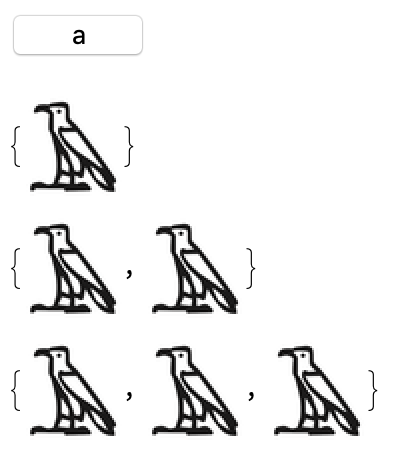

## Creating Keyboard Buttons

Now that each letter is associated with a hieroglyph, we can start to build our keyboard. The best way to do this is to build a `Button`.

--- task ---
Create a `Button` with the label `a`, which prints the hieroglyph associated with the letter `a`.

```Button["a", {Print[egypt["a"]]}]```


--- /task ---

Great! But we don't just want to print one letter. We want to be able to add letters to a word. Instead of using `Print` to print the `Value` each time we press the button, let's use `AppendTo` to add the `Value` to the end of a list.

Lists start with `{`, end with `}`, and each item is separated by a `,`.

 --- task ---
Create a list called `newWord`. Adapt the `Button` you created in the last task to `AppendTo` the list `newWord` instead of printing. Adapt the `Button` to `Print` the list `newWord`.

```
newWord = {};
Button["a", {AppendTo[newWord, egypt["a"]], Print[newWord]}]
```

 --- /task ---
 
 If you press this button three times, you should get this output:



