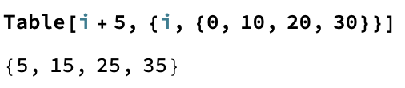

## Building the Keyboard

In the last step, we created a `Button` for the letter `"a"`.

We want to be able to add any letter to the word. We could make each button individually, like we did in the last step. Or, we could use the `Table` function to repeat an action over every `Key`.

Let's look at an example of `Table`. Try to work out what the function is doing.



If you are familiar with other programming languages, `Table` works a lot like a for loop in many lanugages. For example, we might want to add 5 to every number in a list. `Table` does this by taking two arguments: the action, and the list. So to add five to every number in a list, we would do: `Table[i+5, {i, {0,10,20,30}}]`. This code would return `{5, 15, 25, 35}`.

We can use `Table` to create buttons for every `Key` in our `Association`.

You can get a list of all the `Keys` using `Keys[egypt]`. This will return all the letters of the alphabet which we have used as `Keys`.

Instead of running `"a"` through the `Association` to return the hieroglyph for `"a"`, this time we want to be able to press a button for any letter, and have the hieroglyph for that letter added to the list `newWord`. In order to do this, we need to use a dummy variable, like `i` instead of a letter. Then, each time we press one of the buttons, the dummy variable `i` will be replaced with the `Value` of that button.

We also need to tell the `Table` function that we want to use whatever replaces the dummy `i` when we press a button as the input. We can do this using `With[{i=i}]`.

--- task ---
Use `Table` to build a list of `Button`s. Each button should have the label of the Key in the `Association`, and should add the Value associated with that Key to the list `newWord`.

```
newWord = {};
Table[With[{i = i},
Button[i, {AppendTo[newWord, egypt[i]], Print[newWord]}]],
{i, Keys[egypt]}]
``` 
--- /task ---

You might notice that every time you press the button, the new output appears underneath the old output. It would be better to replace the old output with the new output each time you press the button.

We can do this using `Dynamic`. `Dynamic` displays the dynamically updated value, so each time we reevaluate the code by pressing the button, `Dynamic` will update to the new value.

In order to improve the look of the output, we can get rid of the `{}` and `,` in the list `newWord`, and in the `Table` of buttons, by putting the output into a `Row`.

--- task ---
Make `newWord` print as a row using `Row`.
Make the `Table` of buttons print as a row using `Row`.
Use `Dynamic` to replace the keyboard output each time you press a button. 

```
newWord = {};
Row[Table[
  With[{i = i}, Button[i, {AppendTo[newWord, egypt[i]]}]], {i, 
   Keys[egypt]}]]
Dynamic[Row[newWord]]
```
---/task---
