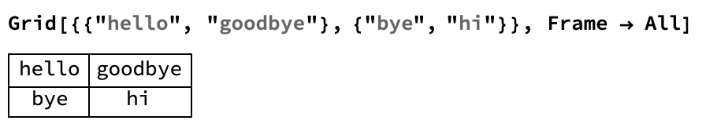
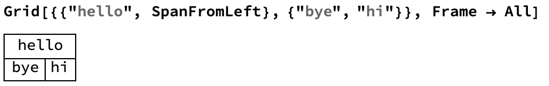
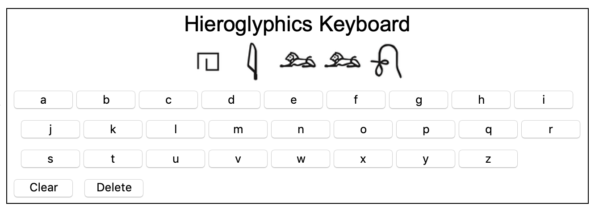

## Improve the Interface

We can construct this using `Grid`.
Let's look at an example of `Grid`



`Grid` is made up of a list of lists, where each list becomes a row in the grid.

--- task ---
Make a `Grid` with three rows. The first row should be the `Dynamic` output of `newWord`. The second row should be the `Table` of buttons which make the keyboard. The third row should be the Clear and Delete buttons we made in the previous step.

Draw a box around the `Grid` by setting `Frame` to `True`.

```
newWord = {};
Grid[{
  {Dynamic[Row[newWord]]},
  {Row[Table[With[{i = i}, Button[i, AppendTo[newWord, egypt[[Key[i]]]]]], {i, Keys[egypt]}]]},
  {Button["Clear", newWord = {}], Button["Delete", newWord = Drop[newWord, -1]]}
  }, Frame -> True]

```
---/task ---

Our keyboard is now functional! Let's make it look more attractive and more useful by adding a title, and improving the placement of the Clear and Delete buttons.

We can span certain elements across the `Grid` using `SpanFromLeft`.



In our `Grid`, the first two rows have one item, and the third row has two items. If we add `SpanFromLeft` to the first two rows, and add a third, blank, element to the third row, then the Clear and Delete buttons will line up on the left.

We can also add a row at the top of the `Grid` with a title. We can use `Text` and `Style` to make the title look like text and print in a large font size.

---task---
+ Use `SpanFromLeft` to shift the Clear and Delete buttons to the left.
+ Add a title to the top of the `Grid`.
+ You can replace all the code you've written (except for the association `egypt`) with your new code.

```
newWord = {};
Grid[{
  {Text[Style["Hieroglyphics Keyboard", 24]], SpanFromLeft},
  {Dynamic[Row[newWord]], SpanFromLeft},
  {Row[Table[With[{i = i}, Button[i, AppendTo[newWord, egypt[[Key[i]]]]]], {i, Keys[egypt]}]], SpanFromLeft},
  {Button["Clear", newWord = {}], Button["Delete", newWord = Drop[newWord, -1]], ""}
  }, Frame -> True]
```
---/task---


